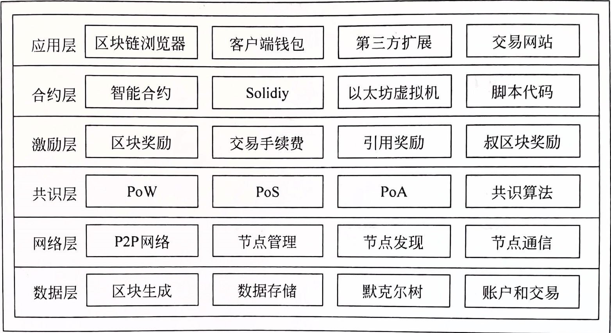

> https://github.com/MetaNodeAcademy/WeeklyTask/blob/main/%E7%AC%AC%201%20%E5%91%A8%20%E6%8E%8C%E6%8F%A1%E5%8C%BA%E5%9D%97%E9%93%BE%E6%8A%80%E6%9C%AF%E5%8E%9F%E7%90%86/4.%20%E4%BB%A5%E5%A4%AA%E5%9D%8A%E5%8E%9F%E7%90%86/Ethereum%E6%8A%80%E6%9C%AF%E7%BB%86%E8%8A%82/Ethereum%E6%8A%80%E6%9C%AF%E7%BB%86%E8%8A%82.md


## 架构图




## 数据层
### 账户
+ 账户分为`外部账户`和`合约账户`, 外部账户可以自主的发起交易，而合约账户是由接收到交易(消息或诶不交易)而触发的合约代码的执行
+ 账户创建
  + `外部账户`是一个密钥, 公钥是账户的账户地址, 私钥是一个加密后的json文件, 创建密钥时, 添加密码来加密私钥
  + `合约账户`是通过部署`智能合约`创建的账户, 它不受密钥的管理, 它被合约部署者控制, 可通过编写函数调整合约所有权的转移或继承，
+ 账户状态
  + `nonce`: 对于外部账户, 这个字段表示该账户发出的交易数量, 用以防止重复交易（双花问题）. 对于合约账户, nonce 表示该账户创建的合约数量
  + `balance`: 账户的余额，单位为 wei, 1 ether 等于 1018 wei
  + `storageRoot`: 这是一个指向 Merkle Patricia Tree（MPT）根节点的哈希值，树中存储了账户的状态信息
  + `codeHash`: 在外部账户中，这个字段通常是一个空字符串的哈希值；而在合约账户中，它表示账户中 EVM 代码（编译后的合约字节码）的哈希。当合约账户接收到一个消息调用时，相关代码将被执行。不同于其他字段，codeHash 是不可变的，它用作从状态数据库检索相应 EVM 代码的索引
+ 账户可通过钱包管理. 通常所指的钱包是一种具有用户界面的应用程序，用户可以通过它访问自己的资金、管理密钥和地址、创建和签署交易、与智能合约进行互动，以及作为去中心化应用（DApps）的接入点

### 交易原理
#### 什么是交易
交易的定义：在以太坊中，交易是一个被签名的数据包，主要用途包括从一个账户向另一个账户转移以太币、调用合约方法或部署新的合约

#### 创建交易
创建交易时，客户端需要填充以下详细信息：
+ nonce: 发送者账户的 nonce，表示该账户发出的交易总数。 
+ GasPrice: 发送者愿意为每单位 Gas 支付的价格。
+ GasLimit: 发送者为这次交易设定的最大 Gas 消耗量。
+ to: 接收者的地址。在创建合约的交易中，此字段为空，采用默认的零地址。
+ value: 以 wei 为单位，从发送者向接收者转移的金额，或者是创建合约时赋予合约账户的初始金额。
+ v, r, s: 这些是交易签名组件，用于验证交易的发送者。其中 v 为 链标识符, 限制交易必须在指定链上进行
+ init: 仅在创建合约类型的交易中使用，用于初始化新合约账户的 EVM 代码片段。init 代码在首次执行时将返回一个永久与合约账户关联的代码体，执行完成后，init 值被丢弃。
+ data: 一个可以包含任意大小的字节数组，用作交易的附加信息，或者包含合约代码及其参数。


#### 交易流程
> 节点里面含有交易内存池, 分为 queue 列表 和 pending 列表</br> </br>
> 其中 queue 列表用于存储那些尚未被矿工打包到区块中的交易，但由于一些原因(gas price 设置过低，或者因为相关账户的 nonce 值不对等问题)暂时不能被处理。
> 通常情况下，这些交易在被矿工打包之前，还会等待合适的条件
> </br></br>
> 这些交易会在符合条件时被转移到 pending 列表。矿工会优先选择那些 gas 价格更高的交易进行打包，因此低 gas price 的交易可能会在队列中停留更长时间
1. **交易的广播过程始于产生该交易的节点, 然后交易广播给相邻节点, 最后扩散到全网节点,**
2. **其他节点收到交易后, 将交易添加到queue列表中, 然后等到符合特定条件, 交易添加到pending列表中**
3. **从pending挑选出被打包交易，然后计算哈希值获取记账权，同时将交易交给以太坊虚拟机(EVM)执行. 将交易打包进新区块，然后广播给其他节点, 获取网络其他节点的确认**
4. **其他网络节点收到新区块后, 进行验证和确认，没问题就将新区块添加到本地的区块链**
5. **以太坊执行后会有一个凭据，待到新区块添加到区块链中后, 以太坊会将数据记录到底层数据库中**

#### 区块分叉
当多个矿工同时成功打包区块并广播到网络中时，网络会暂时出现 区块链分叉。这种情况通常发生在以下两种情况之一：

1. 两个矿工几乎同时成功挖出新区块，并将其广播到网络中，导致网络中的不同节点接收到不同的区块，产生了分叉。

2. 网络延迟：由于网络传输的延迟，不同节点接收到区块的顺序不同，导致他们暂时认为不同的区块是链的扩展。

这种分叉是正常的，且通常会被以太坊（和其他使用类似共识机制的区块链）网络自动处理。分叉之后，网络中的节点会通过 最长链规则 和 共识协议 来最终解决分叉问题。

**分叉发生的原因**:
+ 网络延迟：矿工可能几乎在同一时刻成功挖出新区块并广播到网络中，由于传播延迟，网络中的不同节点可能接收到不同的区块，导致分叉。

+ 多个矿工同时找到解：在区块链中，尤其是像比特币或以太坊这样的公链，存在一个 随机性，即矿工通过竞争解决工作量证明问题，几乎同时找到新区块的情况是可能发生的。

**分叉后的处理过程**：
1. 分叉阶段：
当区块链发生分叉时，两个不同的区块（比如区块 X 和 Y）会同时存在于网络的不同节点中。这意味着，某些节点认为链的最新区块是 X，而其他节点认为是 Y。这时，网络就会出现一个临时的分叉。

2. 最长链规则(Longest Chain Rule)
   + 最长链规则 是区块链网络解决分叉问题的基本规则。在区块链中， 最长链 是指包含最多工作量（即计算资源消耗）的链。因此， 最长链会被认为是有效的主链，而所有其他较短的链都会被视为分叉。
   + 在分叉发生后，网络中的节点会继续挖掘新的区块并尝试扩展他们认为的最新区块。
   + 如果一个区块链分叉，节点会继续根据自己认为是最长的链进行挖矿，直到有更多的区块被挖掘出来，导致其中一个分叉链成为最长链，最终被大多数节点接受。

3. 新区块的添加
   + 假设有两个矿工分别挖出了 区块X 和 区块Y，并且区块链暂时出现了分叉。随后，网络中的其他节点会继续工作，矿工会选择基于自己接收到的区块继续挖矿。假设矿工基于 区块X 成功挖出一个新区块 区块Z，而另一个矿工基于 区块Y 成功挖出 区块W。
   + 网络中的大多数节点接收到 区块Z，这导致 区块Z 的链变得更长。于是，区块X 和区块Z 形成了新的主链，而 区块Y 和区块W 被孤立。
   + 一旦一个分叉链的长度超过了其他链，网络中的节点会 自动选择 最长链作为有效链，并将其余的分叉链舍弃。

4. 孤立区块（Orphan Block）处理：
   + 孤立区块（Orphan Block）指的是在分叉发生后，某个区块不再属于主链，而被丢弃的区块。在上面的例子中，区块Y 和 区块W 就会变成孤立区块，因为它们没有延续最长链。
   + 当一个区块被标记为孤立区块后，它的交易会被从区块链中移除， 但这些交易不会丢失。它们会被重新放回交易池（Transaction Pool）中，等待下一个区块被打包。
   + 孤立区块会被节点丢弃，但这并不意味着它们完全无效。孤立区块中的交易会再次进行验证，如果它们有效，会被重新添加到新的区块中。

5. 最终确认：
   + 一旦某个分叉链成为网络中的主链（即最长链），网络中的节点就会认为分叉解决，之前的分叉部分被丢弃，区块被视为最终确认。
   + 这个过程可能需要一段时间，因为网络中不同节点的同步可能有延迟。通常情况下，区块获得 6个确认 被认为是相当安全的。

6. **为什么要使用最长链规则？**
   + 防止双花攻击（Double Spending）：通过确保网络中的所有节点都认同同一条链，最长链规则避免了不同节点之间的交易数据不一致，防止了双花攻击的发生（即同一笔资产被多次花费）。
   + 去中心化：最长链规则使得所有节点都依赖于相同的规则，不需要依赖任何中心化的机构来决定哪个区块是有效的，确保了区块链的去中心化和透明性。

7. 区块链分叉的影响
   + 交易的不可逆性：一旦区块被包含在主链中并得到足够多的确认，它就会变得不可篡改。如果区块在分叉中成为孤立区块，它包含的交易就会被回滚，但这些交易通常会很快重新包含到新的区块中。
   + 矿工的行为：矿工们会根据最长链的规则继续挖掘并扩展他们认为的主链。若某个矿工发现自己挖的区块被孤立，他们会迅速放弃该区块并继续挖掘基于其他链的新区块。


### 激励层
普通区块奖励
这是奖励给挖出区块的矿工的，具体规则如下：
+ 固定奖励 3 ETH（拜占庭分叉后，将原来的 5 ETH 奖励降为 3 ETH）。
+ 区块内所有交易的交易费。
+ 如果普通区块引用了 uncle 区块，每引用一个 uncle 区块可以得到固定奖励 3 ETH 的 1/32，最多只能引用 2 个 uncle 区块。

uncle 区块奖励
```
uncle 区块奖励=（uncle 区块高度 + 8 - 引用 uncle 区块的普通区块高度）x 普通区块的固定奖励/8
```